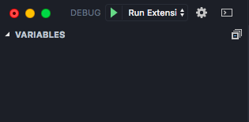

# 開始貢獻 vscode-ptt

## 1. Fork, Clone 專案

我就略過了，身為一個專業的 GitHuber，這應該是基礎（指）

## 2. 安裝 dependencies

確定你有 node 環境，切到專案目錄跑：

```bash
cd /path/to/extension
npm install
```

## 3. 用 VSCode 開啟專案

寫 VSCode Extension 當然要用 VSCode 啊？

```bash
code .
```

## 4. 跑 VSCode 的 Debug Task

選 Run Extension，就會自動開始建制並跑起新的 VSCode 視窗開始 Debug 了



## 5. 開始玩！

其餘請參考 VSCode 官方文件。對沒有中文 😂

- https://code.visualstudio.com/api/get-started/your-first-extension

## 6. 開 Pull Request

原則上都會一兩天內審，等太久直接在 PR mention 我或寄 Email 催，洩洩
