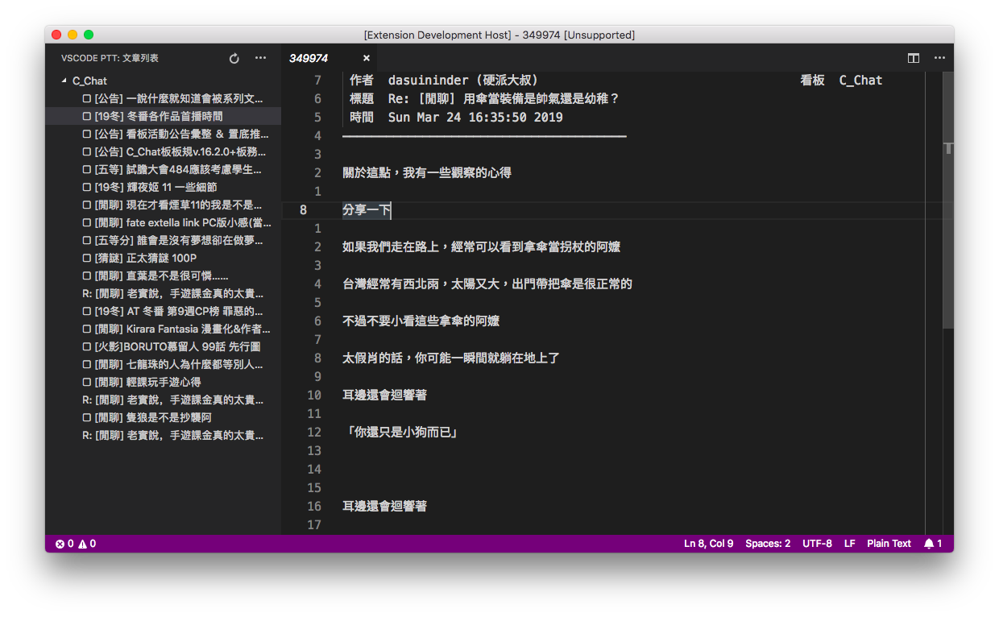
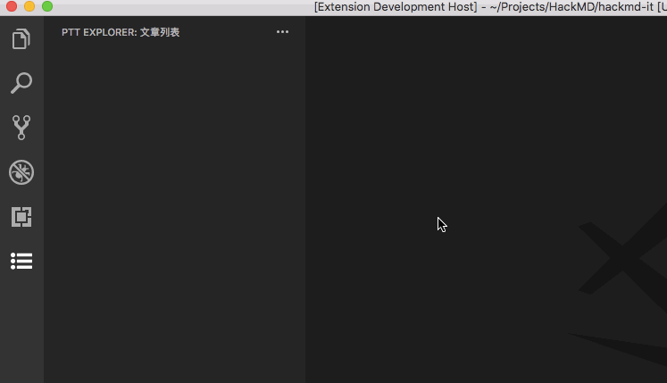
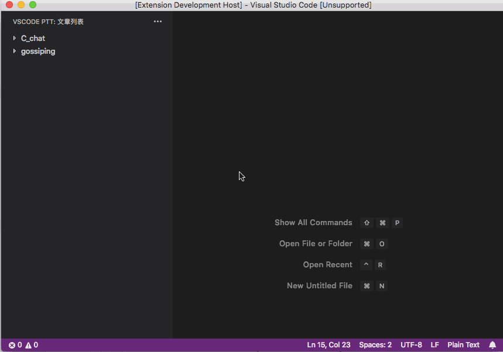

# vscode-ptt

在 VSCode 也要上 PTT！

你以為我在寫扣嗎？甘いよ、お前！我其實在上批踢踢啊！！

## Features

### 新增訂閱看板

### 瀏覽文章 (目前只有唯讀模式)

## Release Notes

### 0.0.1

首次發佈。功能詳見 [MVP Task List](https://github.com/Yukaii/vscode-ptt/issues/2)

## Credits

- 特別感謝 [@kevinptt0323](https://github.com/kevinptt0323) 維護的 [ptt-client](https://github.com/kevinptt0323/ptt-client)，少走了很多路，能夠專注於 VSCode 的 API 串接 ❤️

## LICENSE

WTFPL
